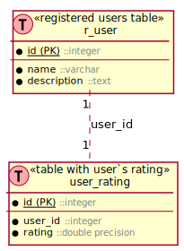

# Sql data filler for spring

## Description

Simplifies data preparation for sql integration tests using parametrized templates.

----

## Requirements

---

1. Java >= 1.8
2. Spring Boot >= 1.3.0

## Build and Install

    mvn clean install

## Usage

    <dependency>
        <groupId>org.bopre.test</groupId>
        <artifactId>spring-test-sql-filler-parent</artifactId>
        <version>${version}</version>
        <scope>test</scope>
    </dependency>

### Templates definition

Sql templates can be used as regular sql with placeholders

Placeholders:

```
    #{<TYPE>/<ARGUMENT_NAME>:<DEFAULT VALUE>}
```

Supported Types:

* INT
* DOUBLE
* STRING

#### Example database schema:

|                         |                             |
|-------------------------|-----------------------------|
| Example database schema |  |

### sql data template (`/test/resources/sql/users.sqtmpl`):

```sql
  INSERT INTO r_user (
      id,
      name,
      description
  ) VALUES (
      #{INT/id:0},
      #{STRING/name:sample name},
      #{STRING/description:some default description}
  );
```

### sql data template cleanup (`/test/resources/sql/users.cleanup.sqtmpl`):

```sql
  DELETE FROM USERS WHERE id = #{LONG/id:0};
```

### tests(java):

##### simple template usage

```java

// + other spring annotations
@EnableSqlFiller //required to work
public class SampleTest {

    @SqlTemplate(
            template = "/sql/users.sqtmpl",
            cleanupTemplate = "/sql/users.cleanup.sqtmpl", //not required, but preferred
            args = {
                    @SqlArg(name = "id", value = "13"),
                    @SqlArg(name = "name", value = "example name")
            }
    )
    @Test
    public void testUsers() {
        // perform tests here
    }

}
```

##### templates pack usage

templates can be combined with custom @annotations

```java

// + other spring annotations
@EnableSqlFiller //required to work
public class SampleTest {

    @Test
    @SqlTemplatePack(value = CustomPack.class, args = {@SqlArg(name = "id", value = "13")}, order = 0)
    @SqlTemplatePack(value = CustomPack.class, args = {@SqlArg(name = "id", value = "14")}, order = 1)
    @SqlTemplatePack(value = CustomPack.class, args = {@SqlArg(name = "id", value = "15")}, order = 2)
    public void testUsers() {
        // perform tests here
    }

    @SqlTemplate(
            template = "/sql/users.sqtmpl",
            cleanupTemplate = "/sql/users.cleanup.sqtmpl", //not required but prefered
            args = {
                    @SqlArg(name = "id", value = "0"),
                    @SqlArg(name = "name", value = "example name")
            }
    )
    // supported multiple SqlTemplates:
    //@SqlTemplate
    //@SqlTemplate
    //@SqlTemplate
    @Retention(RetentionPolicy.RUNTIME)
    @Target(ElementType.METHOD)
    public @interface CustomPack {

    }
}
```

[//]: # (plantuml schemas definitions)

```plantuml
@startuml docs/img/db_schema
!define table(x, descr) class x << (T, #FFAAAA) descr >>
!define primary_key(x) <u>x (PK)</u>
!define foreign_key(x) <u>x (FK)</u>
!define db_type(x) <size:10><color:gray>::x</color></size>
!define commentary(x) <size:10><color:gray>--x</color></size>

table(r_user, registered users table) {
  * primary_key(id) db_type(integer)
  --
  * name db_type(varchar)
  * description db_type(text)
}

table(user_rating, table with user`s rating) {
  * primary_key(id) db_type(integer)
  --
  * user_id db_type(integer)
  * rating db_type(double precision)
}

r_user "1" .. "1" user_rating: user_id

@enduml
```

<!--

-->
